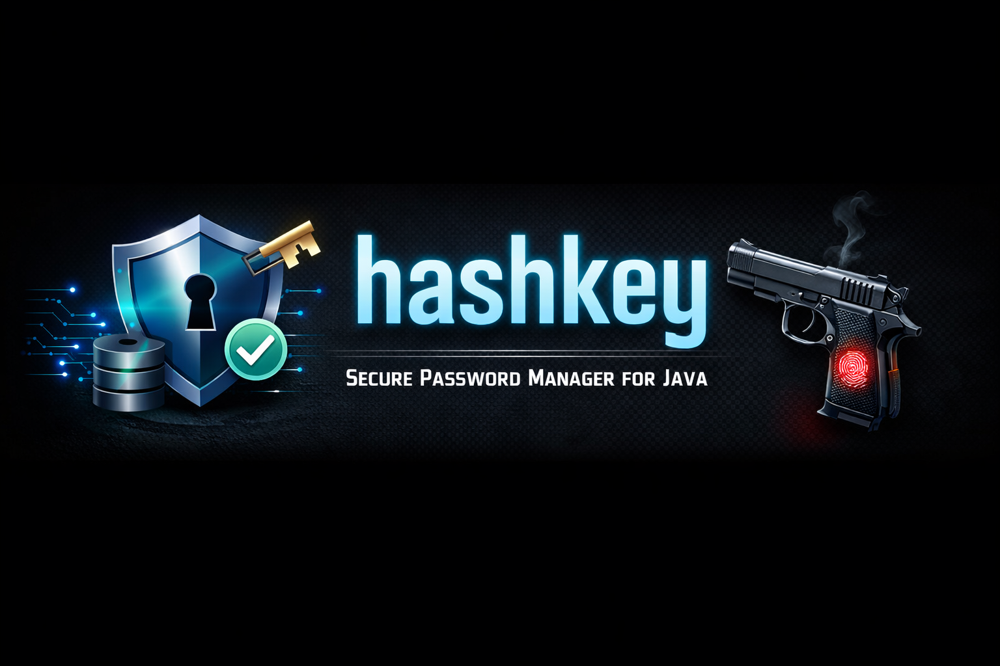

# 🔐 HashKey

<p align="center">
  
</p>

> **Secure Offline Password Vault Core**

**If the system can recover your secrets, so can an attacker.**

[](https://openjdk.java.net/)
[](LICENSE)
[](https://maven.apache.org/)

---

## 🎯 What is HashKey?

HashKey is a **secure, offline-first password vault core** written in Java. It provides the authentication, protection, and persistence foundations required to build a local password manager.

> ⚠️ **Important:** HashKey is a module, not a user-facing application.

---

## 🛡️ The HashKey Promise

| NO CLOUD | NO SYNC | NO BS |
|:--------:|:-------:|:-----:|
| Zero network dependency | Zero telemetry | Zero backdoors |
| All data local | No password recovery | No exceptions |

**All data remains local. Unrecoverable without the master password. By design.**

---

## ✨ What Can It Do?

| 🔒 Security | 📁 Organization | 📴 Privacy |
|------------|----------------|-----------|
| Single master password | Group by category | 100% offline |
| Memory-hard hashing | Username, email, URL | No external calls |
| Brute-force protection | Notes & secrets | Deterministic only |
| Authentication isolation | Full audit trails | Local-first forever |

---

## 🧠 How It Works

```
Master Password → Vault Key → Encrypts All Secrets
     ↓
Failed Attempts → Lockout → Persists to security.meta
```

1. Master password created **locally**
2. All data locked behind it
3. Authentication happens **offline**
4. Repeated failures = temporary lockout
5. Wrong password = **permanent data loss**

> 💀 **There is no recovery mechanism. This is intentional.**

---

## 🏗️ Architecture

| Layer | Purpose |
|-------|---------|
| 📦 Domain Models | Core data structures |
| 💾 Persistence Layer | Database operations |
| 🔐 Security & Authentication | Access control |
| 🔑 Cryptographic Primitives | Encryption/hashing |
| ⚙️ Service Orchestration | Business logic |

**Each layer has one job. No layer knows about the UI.**

---

## 📂 Project Structure

```
hashkey/
│
├── 📁 src/main/java/com/hashkey/hk/
│   │
│   ├── 📦 model/                    # Domain objects
│   │   ├── Organization.java       ✓ Done
│   │   ├── Account.java            ✓ Done
│   │   ├── AuditLog.java           ✓ Done
│   │   └── MasterPassword.java     ✓ Done
│   │
│   ├── 💾 database/                 # Data persistence
│   │   ├── DatabaseManager.java    ✓ Done
│   │   └── dao/                    ⏳ Next
│   │
│   ├── 🔐 security/                 # Auth & protection
│   │                                ⏳ Next
│   │
│   ├── 🔑 crypto/                   # Encryption
│   │                                ⏳ Next
│   │
│   ├── ⚙️  service/                 # Business logic
│   │                                ⏳ Next
│   │
│   └── 🧪 Main.java                 # Test harness
│
├── 📁 resources/
│   └── schema.sql                  ✓ Done
│
├── 📄 pom.xml                       ✓ Done
├── 🗄️  passwords.db                 (generated)
├── 🛡️  security.meta                (generated)
└── 📖 README.md                     ✓ You are here
```

---

## 🚀 Quick Start

**Prerequisites**

```
☕ Java 17+
📦 Maven 3.6+
```

**Build**

```bash
mvn clean compile
```

**Initialize**

```bash
mvn exec:java -Dexec.mainClass="com.hashkey.hk.Main"
```

**Expected Output**

```
✓ Database initialized successfully.
✓ Database setup complete!
✓ Database connection closed.
```

---

## 📊 Implementation Progress

**✅ What's Done**

- [x] Project setup & build system
- [x] Database schema design
- [x] Core domain models
- [x] SQLite connection management
- [x] Offline authentication foundation
- [x] Failed-attempt tracking & lockout
- [x] Master password setup & verification

**🔜 What's Next**

- [ ] Vault key derivation from master password
- [ ] Encryption of stored secrets
- [ ] Full credential management (CRUD)
- [ ] Audit trail integration
- [ ] Service-layer consolidation

**Each step builds on the previous one. No shortcuts.**

---

## 🛡️ Security Model

**Failed-Attempt Protection**

```
Attempt 1: ❌ Failed
Attempt 2: ❌ Failed  
Attempt 3: ❌ Failed
───────────────────────
🔒 LOCKOUT TRIGGERED
⏱️  Wait period enforced
💾 State persists on disk
```

**Why?** To resist brute-force attacks.

**How?** Lockout metadata stored separately from encrypted data.

**Result?** Even if vault is inaccessible, lockout state remains.

---

## 💾 Data Storage

| Feature | Status |
|---------|--------|
| All data stored locally | ✓ |
| Sensitive values encrypted | ✓ |
| Auth state separate | ✓ |
| Indexed for performance | ✓ |

**No cloud. No sync. No exceptions.**

---

## ⚠️ Critical Security Notice

### 🚨 THERE IS NO PASSWORD RECOVERY 🚨

| Reality Check |
|:-------------:|
| **Lost Password = Lost Data** |
| This is not a bug. |
| This is not temporary. |
| This is the design. |

**If you need password recovery, this project is not for you.**

---

## 💭 Final Thought

**HashKey is intentionally quiet.**

If it feels simple, that is by design.  
If it feels boring, it is doing its job.

*The best security is the security you don't notice.*

---

**⚠️ PROJECT STATUS: UNDER ACTIVE DEVELOPMENT**

  
> HashKey is currently in early development. Core features are being implemented.
> APIs and interfaces are subject to change without notice.

---

**Made with 🔐 by developers who forgot their passwords one too many times**
